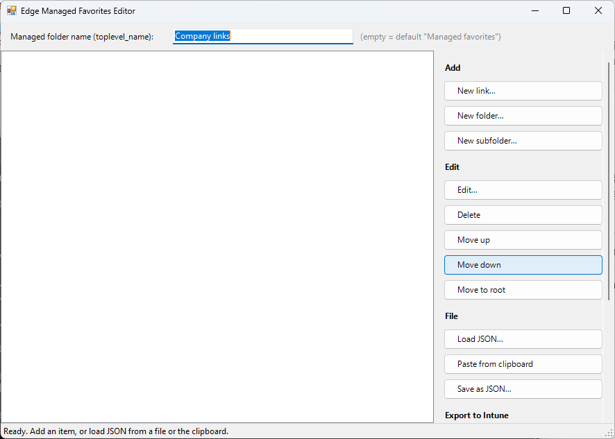

# Edge Managed Favorites Editor

Offline PowerShell tool (WinForms) for building the JSON used by the Microsoft Edge policy
**Configure favorites** (`ManagedFavorites`), as deployed through Microsoft Intune.

No internet, no modules, no installation — a single `.ps1` file.



---

## Running the tool

Right-click the file → **Run with PowerShell**, or from a prompt:

```powershell
powershell -ExecutionPolicy Bypass -File .\Edge-FavoritesEditor.ps1
```

Requires Windows PowerShell 5.1 or PowerShell 7 **on Windows** (WinForms).

---

## What it does

| Feature | Description |
|---|---|
| Tree view | Folders and links, nested to any depth |
| Top-level name | Field at the top fills `toplevel_name` — the folder name shown on the favorites bar |
| Add | *New link* lands inside the selected folder; *New folder* is created next to the selection; *New subfolder* is created inside the selected folder |
| Edit | Double-click an item, or use the *Edit* button |
| Delete | *Delete* button or the Delete key |
| Reorder | *Move up* / *Move down* / *Move to root*, or drag with the mouse |
| Sections | The button groups collapse and expand by clicking their heading. *Add* and *Edit* are open on startup; *File*, *Export to Intune* and *Other* start collapsed |
| Load | From a `.json` file or straight from the clipboard |
| Save | Readable JSON to file (UTF-8 without BOM) |
| Export | *Copy for Settings Catalog* (compact single-line JSON) or *Copy as OMA-URI value* |
| Preview | Shows the formatted JSON in a separate window |

On load the tool accepts both bare JSON and a pasted OMA-URI value
(`<enabled/><data id="ManagedFavorites" value="..."/>`), stripping the wrapper automatically.
`&quot;` escapes and smart quotes are normalised as well.

---

## Deploying in Intune

### Settings catalog (recommended)

1. **Devices → Configuration → Create** → Platform *Windows 10 and later* → Profile type *Settings catalog*
2. **Add settings** → search for `Microsoft Edge` → pick **Configure favorites**
3. Set the toggle to **Enabled**
4. Paste the output of *Copy for Settings Catalog* into the value field
5. Scope tags → Assignments → Review + create

### Custom profile (OMA-URI)

Only needed when the Settings Catalog variant is not usable.

| Field | Value |
|---|---|
| Name | `Microsoft Edge: ManagedFavorites` |
| OMA-URI | `./Device/Vendor/MSFT/Policy/Config/Edge~Policy~microsoft_edge/ManagedFavorites` |
| Data type | String |
| Value | output of *Copy as OMA-URI value* |

---

## JSON format

```json
[
  { "toplevel_name": "Company links" },
  { "name": "Afas Online", "url": "https://login.afasonline.com/" },
  { "name": "Applications",
    "children": [
      { "name": "SharePoint", "url": "contoso.sharepoint.com" }
    ]
  }
]
```

Rules:

- An item with `url` is a link; an item with `children` is a folder.
- Incomplete URLs are expanded by Edge: `microsoft.com` → `https://microsoft.com/`.
- `toplevel_name` is optional; without it the folder is called **Managed favorites**.

---

## Behaviour in Edge

- The folder **cannot be edited or deleted** by the user; hiding it is allowed.
- Managed favorites **do not sync** to the user account and cannot be changed by extensions.
- Dynamic policy refresh: **yes** — no browser restart required.
- Applies per profile; does not apply to a profile signed in with a personal Microsoft account.
- Supported from Edge 77 (Windows/macOS), 30 (Android), 85 (iOS).

---

## Pitfalls

- Use **straight** quotes (`"`). Word and Outlook silently convert them to smart quotes, and the
  policy then fails without any error.
- Paste **only the JSON array** into the Settings Catalog field — no `<enabled/>` wrapper, no
  surrounding quotes.
- Verify the result on a test device via `edge://policy`.

---

## References

- [ManagedFavorites — Microsoft Edge policies](https://learn.microsoft.com/deployedge/microsoft-edge-policies/managedfavorites)
- [Provision favorites for Microsoft Edge](https://learn.microsoft.com/deployedge/edge-learnmore-provision-favorites)
- [Configure Microsoft Edge using Mobile Device Management](https://learn.microsoft.com/deployedge/configure-edge-with-mdm)
